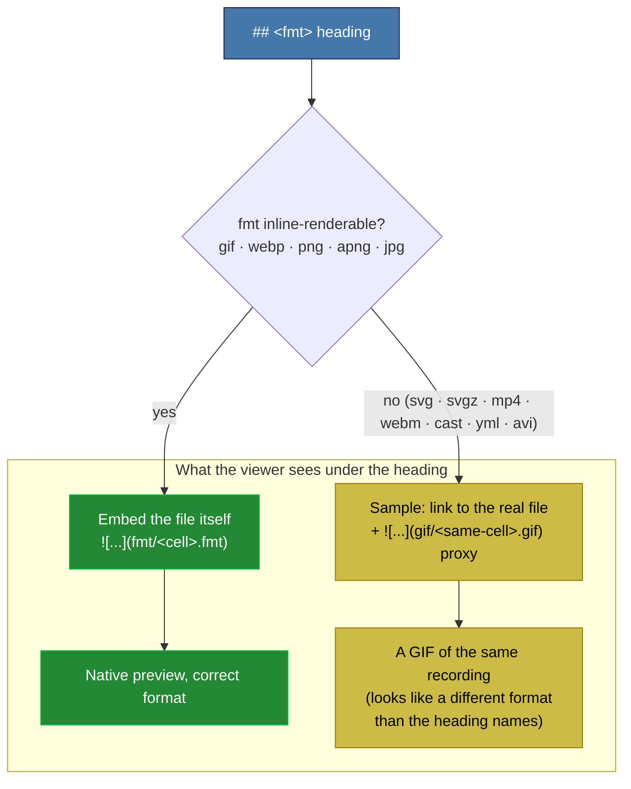

# Asset README Preview Review

Scratch review note (untracked). Reviews whether `assets/<tool>/README.md` showcases the
correct items under each format heading.

## Verdict

The generated asset READMEs are **internally correct**. Three read-only scout audits (all 11
tools) plus a magic-byte scan (514 files, 0 mismatches) agree:

- Every `## <fmt>` heading lists only files whose extension is `.<fmt>`, all present on disk,
  and the "N file(s)" count matches disk.
- Every embedded preview `` points at an existing, GitHub-inline-renderable image
  (`gif` or `webp`) of the **same cell** named in that heading's sample.
- No preview path points at a non-inline format, and no file's bytes disagree with its
  extension.

## The One Thing That Looks Like a "Wrong Format"

GitHub markdown can inline-render only raster/webp images via ``. It cannot inline
`svg`, `svgz`, `mp4`, `webm`, `cast`, `yml`, or `avi`. So `build_report.py` substitutes a
**same-cell GIF proxy** under every non-inline heading, labeled `(gif preview of the same
cell)`. That is why the preview under the `## mp4` / `## webm` / `## svg` heading is a `.gif`:
a deliberate, documented proxy, not a mismatch.

## Options If You Want To Change It

| Option | Effect | Cost / risk |
|--------|--------|-------------|
| Keep GIF proxy (current) | Non-inline headings show a same-cell gif | None; already documented |
| Inline native SVG under `svg` | termsvg / evp / console2svg show the real svg | GitHub svg-in-README is flaky; may render blank |
| HTML5 `<video>` for mp4/webm | Real playable clip | GitHub strips `<video>` from repo-relative README markdown |
| Drop previews for non-inline | No proxy image, link only | Loses the visual entirely |

Recommendation: keep the GIF proxy (it is the only reliable inline option), and optionally
sharpen the caption so the proxy reads as intentional, e.g. `mp4 (not inline on GitHub — GIF
preview below)`.
