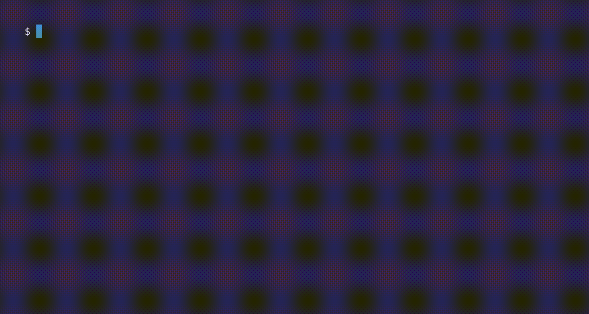
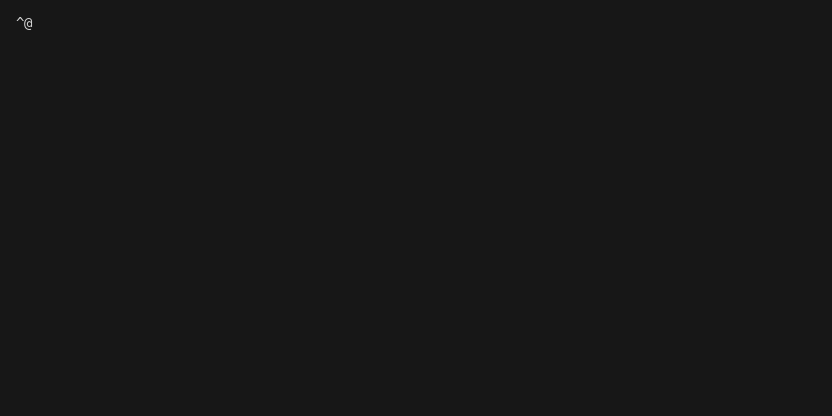
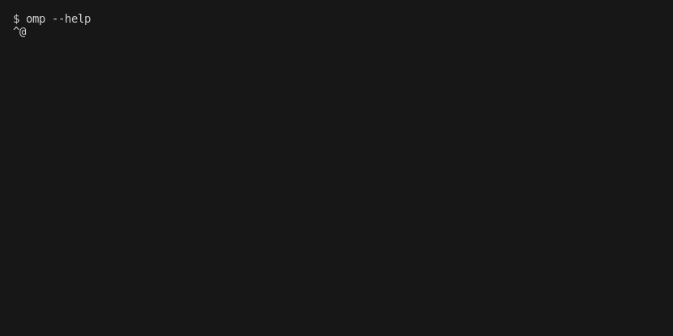
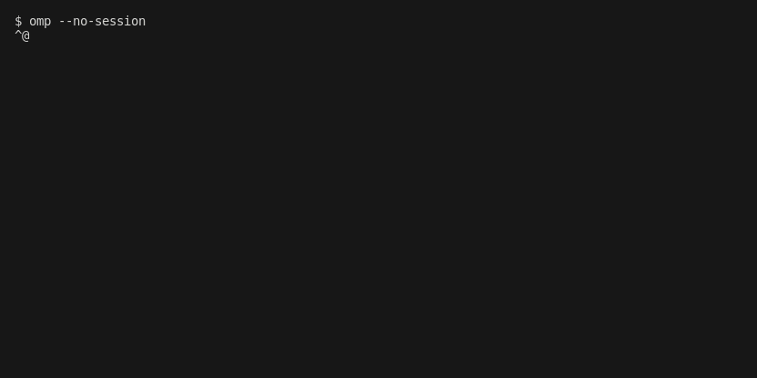

# Terminal Recorder Trials

**Which terminal recorder actually works, on which OS and shell, for recording a real program
(here: [Oh My Pi `omp`](https://omp.sh)) — proven in CI, not by popularity.**

Every verdict below is produced by a GitHub Actions run on the `testing-vhs` branch that uploaded a
GIF artifact. Stars and issue counts never decide the verdict (see
[`.specify/memory/constitution.md`](.specify/memory/constitution.md), Principles I & II). Design
lives in [`specs/001-terminal-recorder-trials/`](specs/001-terminal-recorder-trials/).

## The two families surveyed

## Platform × shell reality

The real split is **PTY (Unix) vs ConPTY (Windows)**, not bash vs zsh. `pwsh` runs everywhere;
`bash` on Windows is Git Bash (not WSL) on GitHub runners. Window-screenshot tools (t-rec, ttygif,
Peek, menyoki) cannot run on headless runners and are excluded with reasons in the ledger below.

## How to read this report

- The **Capability Grid** cell links to the exact CI run that produced (or failed to produce) the
  recording.
- The **Recordings** section embeds the four omp scenarios (`launch-exit`, `help-tour`,
  `tui-splash`, `typing-demo`) for each working tool.
- The **Skipped ledger** lists every candidate not evaluated in CI, with the reason (honest coverage,
  constitution Principle VI).

<!-- REPORT:START -->

_Generated by `scripts/build_report.py` from CI evidence. Verdicts come only from green runs on `testing-vhs` (constitution Principles I & II)._

### CI Status (per tool)

### Capability Grid — headline scenario `launch-exit`

| Tool | Family | linux-bash | linux-pwsh | linux-zsh | macos-zsh | windows-pwsh |
|------|--------|:--:|:--:|:--:|:--:|:--:|
| [VHS][vhs] | scripted | [✅](https://github.com/YoraiLevi/testing-area/actions/runs/35438572350) | [✅](https://github.com/YoraiLevi/testing-area/actions/runs/35438572350) | [✅](https://github.com/YoraiLevi/testing-area/actions/runs/35438572350) | [✅](https://github.com/YoraiLevi/testing-area/actions/runs/35438572350) | [➖](https://github.com/YoraiLevi/testing-area/actions/runs/35438572350)[^na-vhs-windows-pwsh] |
| [console2svg][console2svg] | scripted | [✅](https://github.com/YoraiLevi/testing-area/actions/runs/35439744408) | [✅](https://github.com/YoraiLevi/testing-area/actions/runs/35439744408) | ➖ | [✅](https://github.com/YoraiLevi/testing-area/actions/runs/35439744408) | [✅](https://github.com/YoraiLevi/testing-area/actions/runs/35439744408) |
| [Foley][foley] | scripted | [✅](https://github.com/YoraiLevi/testing-area/actions/runs/35438572375) | ➖ | [✅](https://github.com/YoraiLevi/testing-area/actions/runs/35438572375) | [✅](https://github.com/YoraiLevi/testing-area/actions/runs/35438572375) | ➖ |
| [Betamax (joshka)][betamax] | scripted | [✅](https://github.com/YoraiLevi/testing-area/actions/runs/35438572381) | ➖ | [✅](https://github.com/YoraiLevi/testing-area/actions/runs/35438572381) | [✅](https://github.com/YoraiLevi/testing-area/actions/runs/35438572381) | ➖ |
| [EVP][evp] | scripted | [✅](https://github.com/YoraiLevi/testing-area/actions/runs/35439744332) | ➖ | ➖ | ➖ | ➖ |
| [Demo Tape][demotape] | scripted | [✅](https://github.com/YoraiLevi/testing-area/actions/runs/35438572347) | ➖ | ➖ | [✅](https://github.com/YoraiLevi/testing-area/actions/runs/35438572347) | ➖ |
| [asciinema + agg][asciinema] | interactive | [✅](https://github.com/YoraiLevi/testing-area/actions/runs/35439744335) | ➖ | [✅](https://github.com/YoraiLevi/testing-area/actions/runs/35439744335) | [✅](https://github.com/YoraiLevi/testing-area/actions/runs/35439744335) | ➖ |
| [PowerSession-rs + agg][powersession] | interactive | ➖ | ➖ | ➖ | ➖ | [➖](https://github.com/YoraiLevi/testing-area/actions/runs/35439744382)[^na-powersession-windows-pwsh] |
| [Terminalizer][terminalizer] | interactive | [✅](https://github.com/YoraiLevi/testing-area/actions/runs/35439744395) | ➖ | ➖ | ➖ | ➖ |
| [acast][acast] | interactive | [✅](https://github.com/YoraiLevi/testing-area/actions/runs/35439744411) | ➖ | ➖ | [✅](https://github.com/YoraiLevi/testing-area/actions/runs/35439744411) | [➖](https://github.com/YoraiLevi/testing-area/actions/runs/35439744411)[^na-acast-windows-pwsh] |
| [termsvg][termsvg] | interactive | [✅](https://github.com/YoraiLevi/testing-area/actions/runs/35438572384) | ➖ | ➖ | [✅](https://github.com/YoraiLevi/testing-area/actions/runs/35438572384) | ➖ |

Legend: ✅ working · ❌ broken · ➖ not applicable[^na] · ⬜ not yet run

### Analysis & Recommendations

Reader: an engineer choosing a terminal recorder to capture `omp` in CI. Question: which tool reliably produces a GIF on each OS/shell? Every claim below is counted from committed CI result records, not reputation.

**Per-cell recommendation** — tools whose headline `launch-exit` GIF is green in that cell, ordered by how many of the four scenarios they land:

| Cell | Working recorders (working scenarios / 4) |
|------|-------------------------------------------|
| `linux-bash` | [acast][acast] (4/4), [asciinema + agg][asciinema] (4/4), [Betamax (joshka)][betamax] (4/4), [console2svg][console2svg] (4/4), [Demo Tape][demotape] (4/4), [EVP][evp] (4/4), [Foley][foley] (4/4), [Terminalizer][terminalizer] (4/4), [termsvg][termsvg] (4/4), [VHS][vhs] (4/4) |
| `linux-pwsh` | [console2svg][console2svg] (4/4), [VHS][vhs] (4/4) |
| `linux-zsh` | [asciinema + agg][asciinema] (4/4), [Betamax (joshka)][betamax] (4/4), [Foley][foley] (4/4), [VHS][vhs] (4/4) |
| `macos-zsh` | [acast][acast] (4/4), [asciinema + agg][asciinema] (4/4), [Betamax (joshka)][betamax] (4/4), [console2svg][console2svg] (4/4), [Demo Tape][demotape] (4/4), [Foley][foley] (4/4), [termsvg][termsvg] (4/4), [VHS][vhs] (4/4) |
| `windows-pwsh` | [console2svg][console2svg] (4/4) |

**Green on every declared cell and scenario:** [asciinema + agg][asciinema], [Betamax (joshka)][betamax], [console2svg][console2svg], [Demo Tape][demotape], [EVP][evp], [Foley][foley], [Terminalizer][terminalizer], [termsvg][termsvg].

**Partial coverage (working / declared cell-scenarios):** [acast][acast] (8/12), [VHS][vhs] (16/20).

**No working GIF in CI (honest skip/broken):** [PowerSession-rs + agg][powersession].

### Recordings (per tool: minimal + creative)

**Jump to a recording:** [VHS](#rec-vhs) · [console2svg](#rec-console2svg) · [Foley](#rec-foley) · [Betamax (joshka)](#rec-betamax) · [EVP](#rec-evp) · [Demo Tape](#rec-demotape) · [asciinema + agg](#rec-asciinema) · [Terminalizer](#rec-terminalizer) · [acast](#rec-acast) · [termsvg](#rec-termsvg)

#### [VHS](https://github.com/charmbracelet/vhs) (`linux-bash`)

**launch-exit**

**help-tour**

**tui-splash**

**typing-demo**

#### [console2svg](https://github.com/arika0093/console2svg) (`linux-bash`)

**launch-exit**

**help-tour**

**tui-splash**

**typing-demo**

#### [Foley](https://github.com/GH-Jaider/foley) (`linux-bash`)

**launch-exit**

**help-tour**

**tui-splash**

**typing-demo**

#### [Betamax (joshka)](https://github.com/joshka/betamax) (`linux-bash`)

**launch-exit**

**help-tour**

**tui-splash**

**typing-demo**

#### [EVP](https://github.com/HalFrgrd/evp) (`linux-bash`)

**launch-exit**

**help-tour**

**tui-splash**

**typing-demo**

#### [Demo Tape](https://github.com/fnando/demotape) (`linux-bash`)

**launch-exit**

**help-tour**

**tui-splash**

**typing-demo**

#### [asciinema + agg](https://github.com/asciinema/asciinema) (`linux-bash`)

**launch-exit**

**help-tour**

**tui-splash**

**typing-demo**

#### [Terminalizer](https://github.com/faressoft/terminalizer) (`linux-bash`)

**launch-exit**

**help-tour**

**tui-splash**

**typing-demo**

#### [acast](https://github.com/gvcgo/asciinema) (`linux-bash`)

**launch-exit**

**help-tour**

**tui-splash**

**typing-demo**

#### [termsvg](https://github.com/mrmarble/termsvg) (`linux-bash`)

**launch-exit**

**help-tour**

**tui-splash**

**typing-demo**

### Skipped / Not Evaluated (honest coverage)

| Tool | Reason skipped for CI-GIF evaluation |
|------|--------------------------------------|
| s-vhs | Not a maintained standalone product (means VHS itself or a DIY tmux+asciinema stack). |
| ttysvg | No matching maintained project; closest are termsvg / svg-term-cli / termtosvg. |
| TermRecord | Dead since 2017; outputs self-contained HTML, not GIF. |
| terminal-recorder | Stale since 2020; HTML output, no GIF path. |
| tty-record | Quiet; HTML (asciinema-player) output, no GIF path. |
| ovh-ttyrec | Maintained but no headless GIF path (ttygif needs X11). |
| script / scriptreplay | typescript only; no practical headless GIF converter. |
| t-rec | Screenshots a desktop window; fails on headless GHA (repo confirms). |
| ttygif | Converter needing ImageMagick + X11; fails headless. |
| termgif (pypi) | 1 star, unproven; no CI evidence. |
| asciinema-windows (Ruby) | Niche (1 star); PowerSession-rs is the stronger Windows path. |
| freeze | Static PNG/SVG, not animated GIF. |
| termshot | Static PNG; no Windows asset. |
| termtosvg | Read-only/archived since 2020; SVG only. |
| svg-term-cli | Unmaintained since 2019; SVG only. |
| asciicast2gif | Archived 2022 (PhantomJS); superseded by agg. |
| menyoki | Linux X11/Wayland window capture; needs a display. |
| Peek | GUI app, archived 2025; not headless. |

_Tools discovered beyond the original list and evaluated:_ console2svg, EVP, acast, termsvg.

[^na]: **Not applicable (➖).** Either the recorder does not target that OS/shell combination, so no cell was declared for it (for example EVP and Terminalizer are Linux-only, and Demo Tape, termsvg, Foley, and Betamax publish no Windows build), or the recorder was exercised on that platform in CI but cannot produce a GIF headlessly — those cells carry their own footnote with the exact CI reason.
[^na-acast-windows-pwsh]: **acast — `windows-pwsh`:** acast v0.4.0 record panics on the headless windows-pwsh runner (nil pointer dereference at asciicast/recorder.go:28 -- ConPTY has no attached interactive console to size); the binary itself runs (acast version and agg --version succeed). See run logs.
[^na-powersession-windows-pwsh]: **PowerSession-rs + agg — `windows-pwsh`:** PowerSession v0.1.16 cannot record headlessly on the windows-pwsh runner: its stdout mirror thread calls WriteConsoleW on the runner's redirected (non-console) stdout, which fails with HRESULT 0x80070001 ('Incorrect function') and panics at record.rs:270 (cascading to terminal.rs:263 SendError). Only the asciicast header is written (cast has 0 output events), so no usable GIF is produced. See run logs.
[^na-vhs-windows-pwsh]: **VHS — `windows-pwsh`:** vhs requires ttyd, which is unsupported on Windows CI runners

[vhs]: https://github.com/charmbracelet/vhs
[console2svg]: https://github.com/arika0093/console2svg
[foley]: https://github.com/GH-Jaider/foley
[betamax]: https://github.com/joshka/betamax
[evp]: https://github.com/HalFrgrd/evp
[demotape]: https://github.com/fnando/demotape
[asciinema]: https://github.com/asciinema/asciinema
[powersession]: https://github.com/Watfaq/PowerSession-rs
[terminalizer]: https://github.com/faressoft/terminalizer
[acast]: https://github.com/gvcgo/asciinema
[termsvg]: https://github.com/mrmarble/termsvg
<!-- REPORT:END -->

## Reproduce

This project is validated in CI only. Trigger a tool via the Actions tab
(`rec-<tool>` → Run workflow on `testing-vhs`) or push a change under `scenarios/**`. See
[`specs/001-terminal-recorder-trials/quickstart.md`](specs/001-terminal-recorder-trials/quickstart.md).
