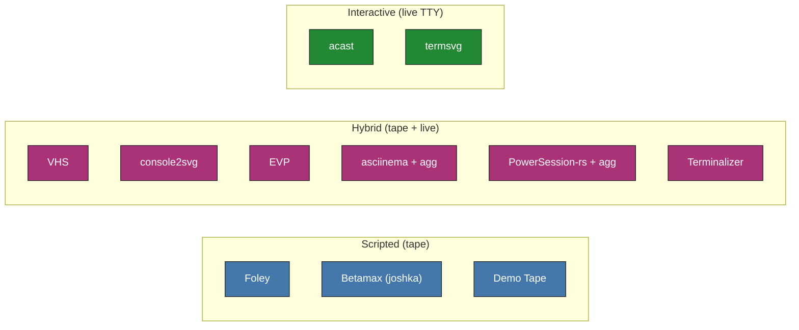

# Terminal Recorder Trials

CI bake-off of terminal-to-GIF recorders against one TUI, [Oh My Pi (`omp`)](https://omp.sh).
A cell counts as working only when a `testing-vhs` GitHub Actions job committed a GIF.

## Recorder Families

## Platform and Shell

The split that matters is PTY (Linux and macOS) versus ConPTY (Windows), not bash versus zsh.

## How to Read This Report

The grid is the `launch-exit` tape (start `omp`, quit); each cell also runs `help-tour`,
`tui-splash`, and `typing-demo`.

<!-- REPORT:START -->

_Generated from committed CI results on `testing-vhs`._

### Capability Grid (headline scenario `launch-exit`)

| Tool | Family | linux-bash | linux-pwsh | linux-zsh | macos-zsh | windows-pwsh |
|------|--------|:--:|:--:|:--:|:--:|:--:|
| [VHS][vhs] gif · mp4 · webm | hybrid | [✅](https://github.com/YoraiLevi/testing-area/actions/runs/35550134845) | [✅](https://github.com/YoraiLevi/testing-area/actions/runs/35550134845) | [✅](https://github.com/YoraiLevi/testing-area/actions/runs/35550134845) | [✅](https://github.com/YoraiLevi/testing-area/actions/runs/35550134845) | [➖](https://github.com/YoraiLevi/testing-area/actions/runs/35550134845)1 |
| [console2svg][console2svg] svg · gif · mp4 · webm | hybrid | [✅](https://github.com/YoraiLevi/testing-area/actions/runs/35567181044) | [✅](https://github.com/YoraiLevi/testing-area/actions/runs/35567181044) | [✅](https://github.com/YoraiLevi/testing-area/actions/runs/35567181044) | [✅](https://github.com/YoraiLevi/testing-area/actions/runs/35567181044) | [✅](https://github.com/YoraiLevi/testing-area/actions/runs/35567181044) |
| [Foley][foley] gif · mp4 · webm · webp · cast | scripted | [✅](https://github.com/YoraiLevi/testing-area/actions/runs/35569668217) | [✅](https://github.com/YoraiLevi/testing-area/actions/runs/35569668217) | [✅](https://github.com/YoraiLevi/testing-area/actions/runs/35569668217) | [✅](https://github.com/YoraiLevi/testing-area/actions/runs/35569668217) | ➖2 |
| [Betamax (joshka)][betamax] gif · webp · mp4 · webm | scripted | [✅](https://github.com/YoraiLevi/testing-area/actions/runs/35567181010) | [✅](https://github.com/YoraiLevi/testing-area/actions/runs/35567181010) | [✅](https://github.com/YoraiLevi/testing-area/actions/runs/35567181010) | [✅](https://github.com/YoraiLevi/testing-area/actions/runs/35567181010) | ➖3 |
| [EVP][evp] gif · svg · svgz | hybrid | [✅](https://github.com/YoraiLevi/testing-area/actions/runs/35569668208) | [✅](https://github.com/YoraiLevi/testing-area/actions/runs/35569668208) | [✅](https://github.com/YoraiLevi/testing-area/actions/runs/35569668208) | [✅](https://github.com/YoraiLevi/testing-area/actions/runs/35569668208) | ➖4 |
| [Demo Tape][demotape] gif · mp4 · webm · avi | scripted | [✅](https://github.com/YoraiLevi/testing-area/actions/runs/35567181070) | ➖5 | [✅](https://github.com/YoraiLevi/testing-area/actions/runs/35567181070) | [✅](https://github.com/YoraiLevi/testing-area/actions/runs/35567181070) | ➖6 |
| [asciinema + agg][asciinema] cast · gif | hybrid | [✅](https://github.com/YoraiLevi/testing-area/actions/runs/35569668222) | [✅](https://github.com/YoraiLevi/testing-area/actions/runs/35569668222) | [✅](https://github.com/YoraiLevi/testing-area/actions/runs/35569668222) | [✅](https://github.com/YoraiLevi/testing-area/actions/runs/35569668222) | ➖7 |
| [PowerSession-rs + agg][powersession] cast · gif | hybrid | ➖8 | ➖8 | ➖8 | ➖8 | [✅](https://github.com/YoraiLevi/testing-area/actions/runs/35569668204) |
| [Terminalizer][terminalizer] yml · gif | hybrid | [✅](https://github.com/YoraiLevi/testing-area/actions/runs/35569668277) | [✅](https://github.com/YoraiLevi/testing-area/actions/runs/35569668277) | [✅](https://github.com/YoraiLevi/testing-area/actions/runs/35569668277) | [✅](https://github.com/YoraiLevi/testing-area/actions/runs/35569668277) | [❌](https://github.com/YoraiLevi/testing-area/actions/runs/35569668277)9 |
| [acast][acast] cast · gif | interactive | [✅](https://github.com/YoraiLevi/testing-area/actions/runs/35569668252) | [❌](https://github.com/YoraiLevi/testing-area/actions/runs/35569668252)10 | [✅](https://github.com/YoraiLevi/testing-area/actions/runs/35569668252) | [✅](https://github.com/YoraiLevi/testing-area/actions/runs/35569668252) | [✅](https://github.com/YoraiLevi/testing-area/actions/runs/35569668252) |
| [termsvg][termsvg] cast · svg · gif · webm | interactive | [✅](https://github.com/YoraiLevi/testing-area/actions/runs/35569668272) | [❌](https://github.com/YoraiLevi/testing-area/actions/runs/35569668272)11 | [✅](https://github.com/YoraiLevi/testing-area/actions/runs/35569668272) | [✅](https://github.com/YoraiLevi/testing-area/actions/runs/35569668272) | ➖12 |

Legend: ✅ working · ❌ broken · ➖ not applicable

**Grid notes**

- **➖ not applicable.** No upstream build, or a platform-only dependency. Numbered notes give the cell's cause.

1. **VHS · `windows-pwsh`**: VHS records via ttyd, which has no Windows build (Unix-only); the capture pipeline cannot run on Windows.
2. **Foley · `windows-pwsh`**: Foley builds on libghostty-vt, which has no Windows native build (Unix-only).
3. **Betamax (joshka) · `windows-pwsh`**: Betamax builds on libghostty-vt-sys, which has no Windows native build (unsupported upstream).
4. **EVP · `windows-pwsh`**: EVP ships Linux and macOS binaries only; there is no Windows build.
5. **Demo Tape · `linux-pwsh`**: Demo Tape's --shell flag accepts only bash, zsh, or fish; PowerShell is not a supported shell.
6. **Demo Tape · `windows-pwsh`**: Demo Tape captures through ttyd, which is Unix-only; there is no Windows recording path.
7. **asciinema + agg · `windows-pwsh`**: The asciinema CLI is Unix-only; Windows capture is out of scope (PowerSession-rs is the Windows-native alternative).
8. **PowerSession-rs + agg · `linux-bash`, `linux-pwsh`, `linux-zsh`, `macos-zsh`**: PowerSession-rs is a Windows-only recorder (Win32 ConPTY); it does not run on Unix.
9. **Terminalizer · `windows-pwsh`**: terminalizer is installed and its CLI runs and the config is found and passed, but 'record' fails on Windows with a blank-path ENOENT ('File not found') when spawning the pty recording session headlessly; no valid GIF produced
10. **acast · `linux-pwsh`**: acast (v0.4.0) + agg (v1.9.0) produced no valid GIF for this cell in CI; see run logs
11. **termsvg · `linux-pwsh`**: no valid GIF produced in CI
12. **termsvg · `windows-pwsh`**: termsvg's record command imports syscall.SIGWINCH (POSIX-only); the record subcommand does not compile on Windows.

### What To Use

Headline `launch-exit` green, ranked by how many of the four tapes landed.

| Cell | Working recorders (scenarios / 4) |
|------|-----------------------------------|
| `linux-bash` · `linux-zsh` · `macos-zsh` | [acast][acast] (4/4), [asciinema + agg][asciinema] (4/4), [Betamax (joshka)][betamax] (4/4), [console2svg][console2svg] (4/4), [Demo Tape][demotape] (4/4), [EVP][evp] (4/4), [Foley][foley] (4/4), [Terminalizer][terminalizer] (4/4), [termsvg][termsvg] (4/4), [VHS][vhs] (4/4) |
| `linux-pwsh` | [asciinema + agg][asciinema] (4/4), [Betamax (joshka)][betamax] (4/4), [console2svg][console2svg] (4/4), [EVP][evp] (4/4), [Foley][foley] (4/4), [Terminalizer][terminalizer] (4/4), [VHS][vhs] (4/4) |
| `windows-pwsh` | [acast][acast] (4/4), [console2svg][console2svg] (4/4), [PowerSession-rs + agg][powersession] (4/4) |

**Green on every cell they target:** [asciinema + agg][asciinema] (16/16), [Betamax (joshka)][betamax] (16/16), [console2svg][console2svg] (20/20), [Demo Tape][demotape] (12/12), [EVP][evp] (16/16), [Foley][foley] (16/16), [PowerSession-rs + agg][powersession] (4/4), [VHS][vhs] (16/16, 4 N/A).

**Attempted and failed at least one cell:** [acast][acast] (17/20), [Terminalizer][terminalizer] (16/20), [termsvg][termsvg] (12/16).

### Recordings

Each tool's recordings, one sample per output format, live on its asset page.

**Jump to a recording:** [VHS](assets/vhs/README.md) · [console2svg](assets/console2svg/README.md) · [Foley](assets/foley/README.md) · [Betamax (joshka)](assets/betamax/README.md) · [EVP](assets/evp/README.md) · [Demo Tape](assets/demotape/README.md) · [asciinema + agg](assets/asciinema/README.md) · [PowerSession-rs + agg](assets/powersession/README.md) · [Terminalizer](assets/terminalizer/README.md) · [acast](assets/acast/README.md) · [termsvg](assets/termsvg/README.md)

### Skipped Tools

| Tool | Reason skipped for CI-GIF evaluation |
|------|--------------------------------------|
| s-vhs | Not a maintained standalone product (means VHS itself or a DIY tmux+asciinema stack). |
| ttysvg | No matching maintained project; closest are termsvg / svg-term-cli / termtosvg. |
| TermRecord | Dead since 2017; outputs self-contained HTML, not GIF. |
| terminal-recorder | Stale since 2020; HTML output, no GIF path. |
| tty-record | Quiet; HTML (asciinema-player) output, no GIF path. |
| ovh-ttyrec | Maintained but no headless GIF path (ttygif needs X11). |
| script / scriptreplay | typescript only; no practical headless GIF converter. |
| t-rec | Screenshots a desktop window; fails on headless GHA (repo confirms). |
| ttygif | Converter needing ImageMagick + X11; fails headless. |
| termgif (pypi) | 1 star, unproven; no CI evidence. |
| asciinema-windows (Ruby) | Niche (1 star); PowerSession-rs is the stronger Windows path. |
| freeze | Static PNG/SVG, not animated GIF. |
| termshot | Static PNG; no Windows asset. |
| termtosvg | Read-only/archived since 2020; SVG only. |
| svg-term-cli | Unmaintained since 2019; SVG only. |
| asciicast2gif | Archived 2022 (PhantomJS); superseded by agg. |
| menyoki | Linux X11/Wayland window capture; needs a display. |
| Peek | GUI app, archived 2025; not headless. |

_Tools discovered beyond the original list and evaluated:_ console2svg, EVP, acast, termsvg.

### CI Status

[vhs]: https://github.com/charmbracelet/vhs
[console2svg]: https://github.com/arika0093/console2svg
[foley]: https://github.com/GH-Jaider/foley
[betamax]: https://github.com/joshka/betamax
[evp]: https://github.com/HalFrgrd/evp
[demotape]: https://github.com/fnando/demotape
[asciinema]: https://github.com/asciinema/asciinema
[powersession]: https://github.com/Watfaq/PowerSession-rs
[terminalizer]: https://github.com/faressoft/terminalizer
[acast]: https://github.com/gvcgo/asciinema
[termsvg]: https://github.com/mrmarble/termsvg
<!-- REPORT:END -->

## How to Reproduce

Run `rec-<tool>` on `testing-vhs` from the Actions tab, or push a change under that tool's
workflow, its `scenarios/` directory, or `scripts/`. See the
[quickstart](specs/001-terminal-recorder-trials/quickstart.md).
