# Terminal Recorder Trials

**Which terminal recorder actually works, on which OS and shell, for recording a real program
(here: [Oh My Pi `omp`](https://omp.sh)) — proven in CI, not by popularity.**

Every verdict below is produced by a GitHub Actions run on the `testing-vhs` branch that uploaded a
GIF artifact. Stars and issue counts never decide the verdict (see
[`.specify/memory/constitution.md`](.specify/memory/constitution.md), Principles I & II). Design
lives in [`specs/001-terminal-recorder-trials/`](specs/001-terminal-recorder-trials/).

## The two families surveyed

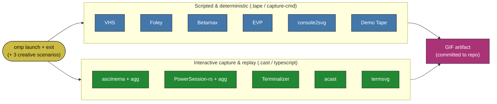

## Platform × shell reality

The real split is **PTY (Unix) vs ConPTY (Windows)**, not bash vs zsh. `pwsh` runs everywhere;
`bash` on Windows is Git Bash (not WSL) on GitHub runners. Window-screenshot tools (t-rec, ttygif,
Peek, menyoki) cannot run on headless runners and are excluded with reasons in the ledger below.

## How to read this report

- The **Capability Grid** cell links to the exact CI run that produced (or failed to produce) the
  recording.
- The **Recordings** section embeds the four omp scenarios (`launch-exit`, `help-tour`,
  `tui-splash`, `typing-demo`) for each working tool.
- The **Skipped ledger** lists every candidate not evaluated in CI, with the reason (honest coverage,
  constitution Principle VI).

<!-- REPORT:START -->

_Generated by `scripts/build_report.py` from CI evidence. Verdicts come only from green runs on `testing-vhs` (constitution Principles I & II)._

### CI Status (per tool)

### Capability Grid — headline scenario `launch-exit`

| Tool | Family | linux-bash | linux-pwsh | linux-zsh | macos-zsh | windows-pwsh |
|------|--------|:--:|:--:|:--:|:--:|:--:|
| VHS | scripted | [✅](https://github.com/YoraiLevi/testing-area/actions/runs/35434967878) | [✅](https://github.com/YoraiLevi/testing-area/actions/runs/35434967878) | [✅](https://github.com/YoraiLevi/testing-area/actions/runs/35434967878) | [✅](https://github.com/YoraiLevi/testing-area/actions/runs/35434967878) | [➖](https://github.com/YoraiLevi/testing-area/actions/runs/35434967878) |
| console2svg | scripted | [✅](https://github.com/YoraiLevi/testing-area/actions/runs/35436959869) | [✅](https://github.com/YoraiLevi/testing-area/actions/runs/35436959869) | ⬜ | [✅](https://github.com/YoraiLevi/testing-area/actions/runs/35436959869) | [✅](https://github.com/YoraiLevi/testing-area/actions/runs/35436959869) |
| Foley | scripted | [✅](https://github.com/YoraiLevi/testing-area/actions/runs/35436959873) | ⬜ | [✅](https://github.com/YoraiLevi/testing-area/actions/runs/35436959873) | [✅](https://github.com/YoraiLevi/testing-area/actions/runs/35436959873) | ⬜ |
| Betamax (joshka) | scripted | ⬜ | ⬜ | ⬜ | ⬜ | ⬜ |
| EVP | scripted | [✅](https://github.com/YoraiLevi/testing-area/actions/runs/35436959848) | ⬜ | ⬜ | ⬜ | ⬜ |
| Demo Tape | scripted | ⬜ | ⬜ | ⬜ | ⬜ | ⬜ |
| asciinema + agg | interactive | [✅](https://github.com/YoraiLevi/testing-area/actions/runs/35436960180) | ⬜ | [✅](https://github.com/YoraiLevi/testing-area/actions/runs/35436960180) | [✅](https://github.com/YoraiLevi/testing-area/actions/runs/35436960180) | ⬜ |
| PowerSession-rs + agg | interactive | ⬜ | ⬜ | ⬜ | ⬜ | ⬜ |
| Terminalizer | interactive | ⬜ | ⬜ | ⬜ | ⬜ | ⬜ |
| acast | interactive | [✅](https://github.com/YoraiLevi/testing-area/actions/runs/35437089258) | ⬜ | ⬜ | [✅](https://github.com/YoraiLevi/testing-area/actions/runs/35437089258) | [➖](https://github.com/YoraiLevi/testing-area/actions/runs/35437089258) |
| termsvg | interactive | [✅](https://github.com/YoraiLevi/testing-area/actions/runs/35436806824) | ⬜ | ⬜ | [✅](https://github.com/YoraiLevi/testing-area/actions/runs/35436806824) | ⬜ |

Legend: ✅ working · ❌ broken · ➖ not applicable · ⬜ not yet run

### Recordings (per tool: minimal + creative)

#### VHS (`linux-bash`)

**launch-exit**

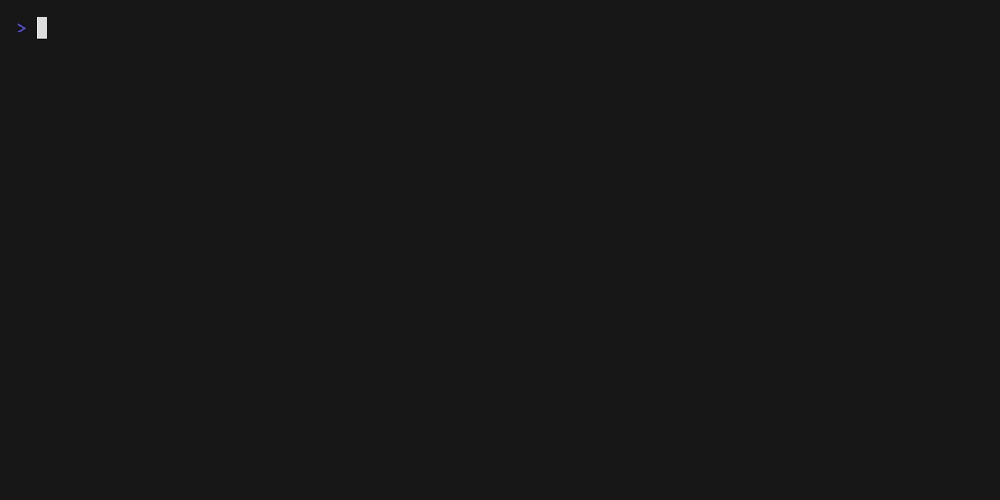

**help-tour**

**tui-splash**

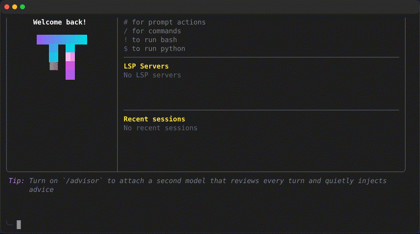

**typing-demo**

#### console2svg (`linux-bash`)

**launch-exit**

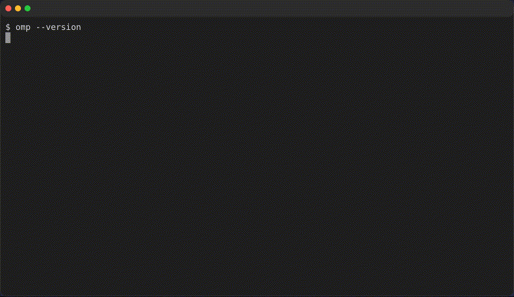

**help-tour**

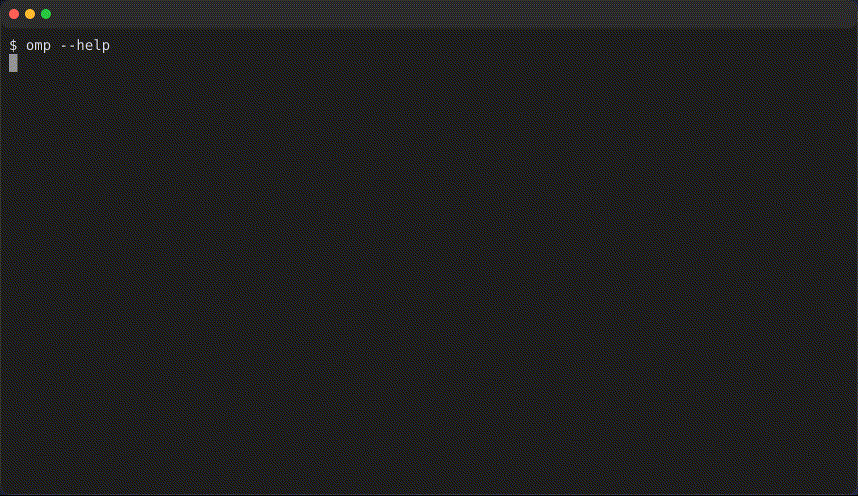

**tui-splash**

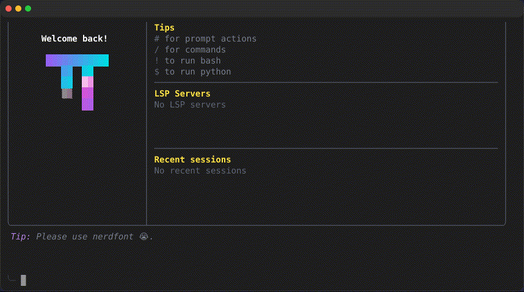

**typing-demo**

#### Foley (`linux-bash`)

**launch-exit**

**help-tour**

**tui-splash**

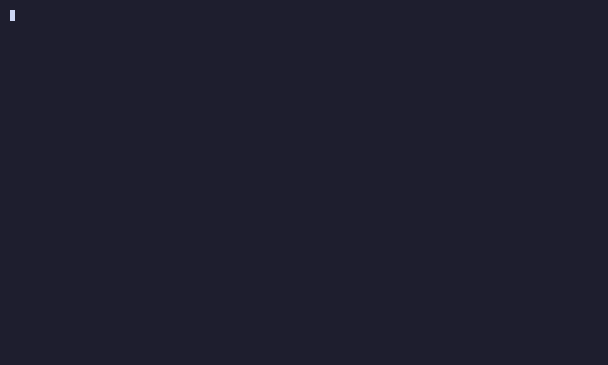

**typing-demo**

#### EVP (`linux-bash`)

**launch-exit**

**help-tour**

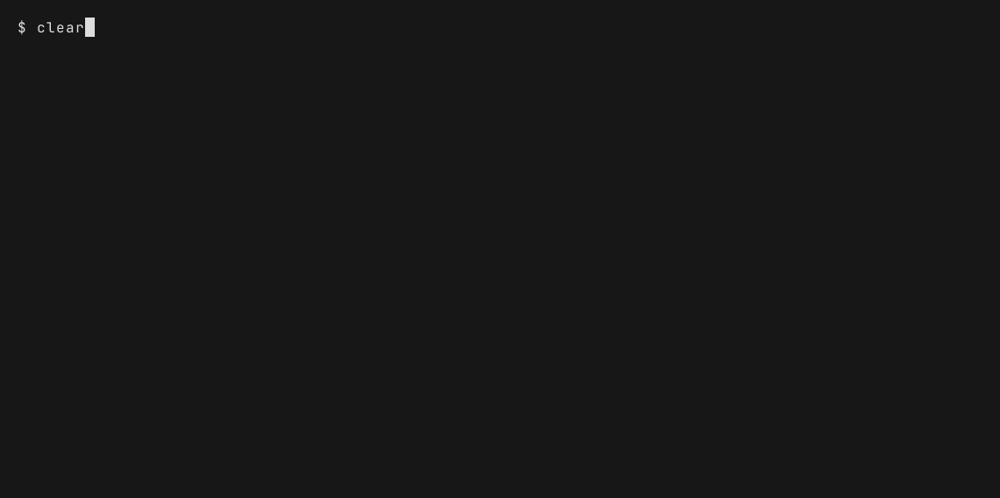

**tui-splash**

**typing-demo**

#### asciinema + agg (`linux-bash`)

**launch-exit**

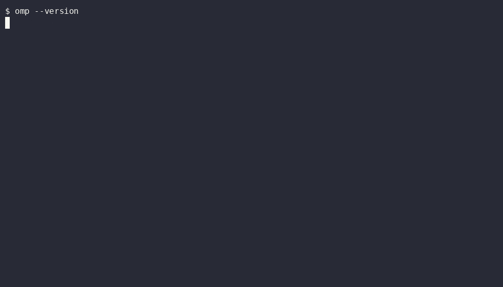

**help-tour**

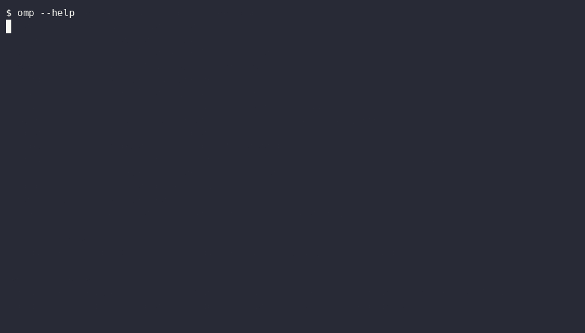

**tui-splash**

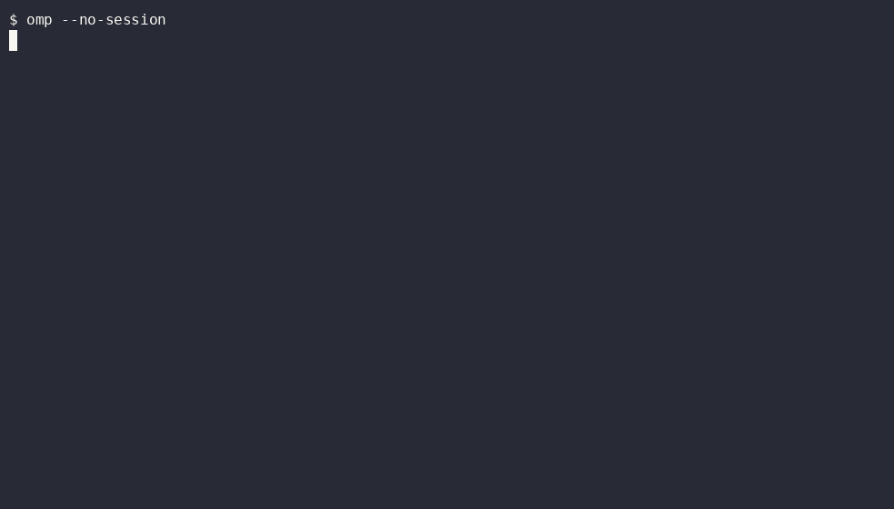

**typing-demo**

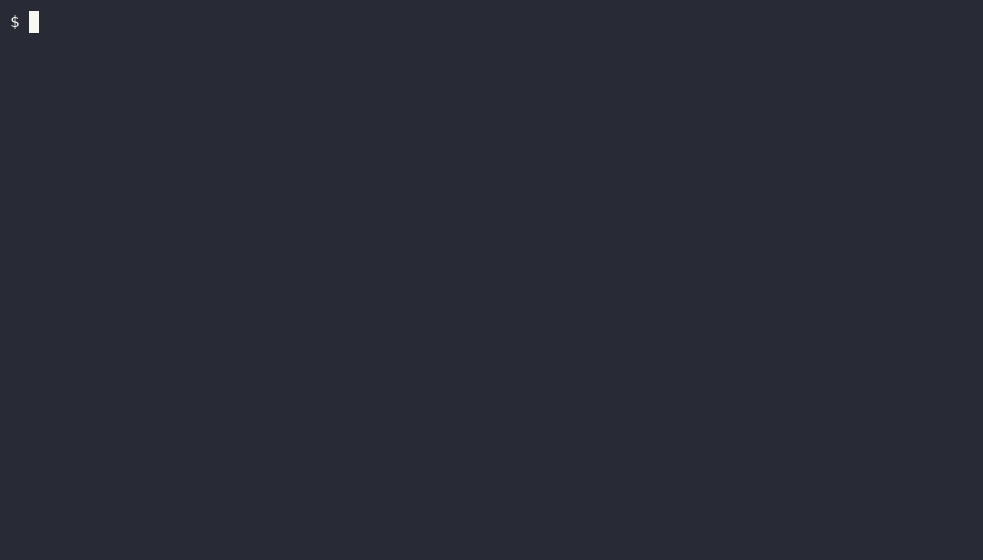

#### acast (`linux-bash`)

**launch-exit**

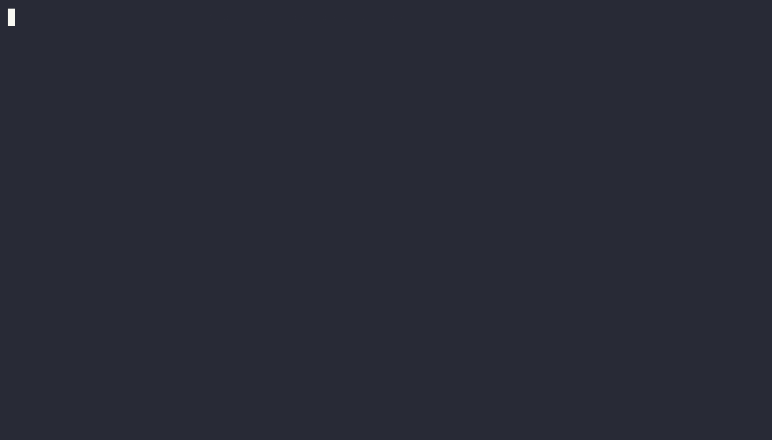

**help-tour**

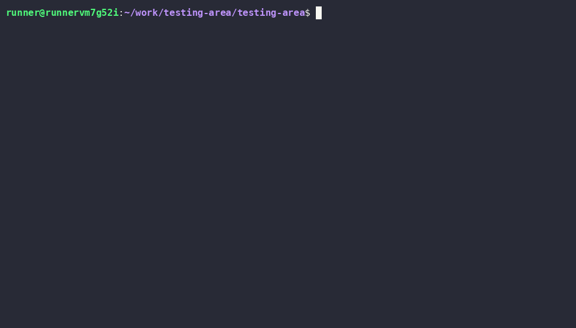

**tui-splash**

**typing-demo**

#### termsvg (`linux-bash`)

**launch-exit**

**help-tour**

### Skipped / Not Evaluated (honest coverage)

| Tool | Reason skipped for CI-GIF evaluation |
|------|--------------------------------------|
| s-vhs | Not a maintained standalone product (means VHS itself or a DIY tmux+asciinema stack). |
| ttysvg | No matching maintained project; closest are termsvg / svg-term-cli / termtosvg. |
| TermRecord | Dead since 2017; outputs self-contained HTML, not GIF. |
| terminal-recorder | Stale since 2020; HTML output, no GIF path. |
| tty-record | Quiet; HTML (asciinema-player) output, no GIF path. |
| ovh-ttyrec | Maintained but no headless GIF path (ttygif needs X11). |
| script / scriptreplay | typescript only; no practical headless GIF converter. |
| t-rec | Screenshots a desktop window; fails on headless GHA (repo confirms). |
| ttygif | Converter needing ImageMagick + X11; fails headless. |
| termgif (pypi) | 1 star, unproven; no CI evidence. |
| asciinema-windows (Ruby) | Niche (1 star); PowerSession-rs is the stronger Windows path. |
| freeze | Static PNG/SVG, not animated GIF. |
| termshot | Static PNG; no Windows asset. |
| termtosvg | Read-only/archived since 2020; SVG only. |
| svg-term-cli | Unmaintained since 2019; SVG only. |
| asciicast2gif | Archived 2022 (PhantomJS); superseded by agg. |
| menyoki | Linux X11/Wayland window capture; needs a display. |
| Peek | GUI app, archived 2025; not headless. |

_Tools discovered beyond the original list and evaluated:_ console2svg, EVP, acast, termsvg.

<!-- REPORT:END -->

## Reproduce

This project is validated in CI only. Trigger a tool via the Actions tab
(`rec-<tool>` → Run workflow on `testing-vhs`) or push a change under `scenarios/**`. See
[`specs/001-terminal-recorder-trials/quickstart.md`](specs/001-terminal-recorder-trials/quickstart.md).
