# Terminal Recorder Trials

CI bake-off of terminal-to-GIF recorders, filmed against one real TUI program,
[Oh My Pi (`omp`)](https://omp.sh). Stars do not decide anything: a tool counts as working
only when a GitHub Actions job on `testing-vhs` committed a GIF for that OS and shell.

Working cells are green CI jobs that committed a GIF under [`assets/`](assets/). Broken cells
link to the failing run. Not-applicable cells are upstream limits, often with no job at all.
Design notes live in [`specs/001-terminal-recorder-trials/`](specs/001-terminal-recorder-trials/)
and the evidence rules in [`.specify/memory/constitution.md`](.specify/memory/constitution.md).

## Recorder Families

Each recorder drives `omp` by playing a scripted tape or by capturing a live session; several
support both. The grid's `Family` column uses these same three labels.

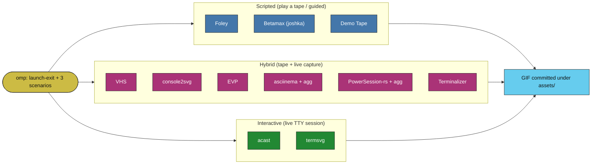

## Platform and Shell

The split that matters is PTY (Linux and macOS) versus ConPTY (Windows), not bash versus zsh.
The grid runs five cells: linux `{bash, zsh, pwsh}`, macos `zsh`, and windows `pwsh`. Other
OS and shell pairs are out of scope, not silently failing. Tools that screenshot a desktop
window cannot run on headless runners, so they sit in the Skipped table below.

## How to Read This Report

- Working and broken grid cells link to their CI run; a bare `➖` is an upstream limit with no job.
- Four tapes drive each cell: `launch-exit` (start `omp`, quit), `help-tour` (help text),
  `tui-splash` (the TUI), and `typing-demo` (typed input).
- Recordings show all four scenarios from one representative working cell (linux-bash when it
  exists); the other green cells are in the grid and under [`assets/`](assets/).
- The Skipped table lists every candidate not evaluated in CI, with the reason.

<!-- REPORT:START -->

_Generated by `scripts/build_report.py` from committed CI results on `testing-vhs`. Working = a green job that committed a GIF; ❌ = a run that failed to; ➖ = an upstream limit (often no job). Stars never decide a verdict (constitution I & II)._

### Capability Grid (headline scenario `launch-exit`)

| Tool | Family | linux-bash | linux-pwsh | linux-zsh | macos-zsh | windows-pwsh |
|------|--------|:--:|:--:|:--:|:--:|:--:|
| [VHS][vhs] gif · mp4 · webm | hybrid | [✅](https://github.com/YoraiLevi/testing-area/actions/runs/35533474581) | [✅](https://github.com/YoraiLevi/testing-area/actions/runs/35533474581) | [✅](https://github.com/YoraiLevi/testing-area/actions/runs/35533474581) | [✅](https://github.com/YoraiLevi/testing-area/actions/runs/35533474581) | [➖](https://github.com/YoraiLevi/testing-area/actions/runs/35533474581)1 |
| [console2svg][console2svg] svg · gif · mp4 · webm | hybrid | [✅](https://github.com/YoraiLevi/testing-area/actions/runs/35540912289) | [✅](https://github.com/YoraiLevi/testing-area/actions/runs/35540912289) | [✅](https://github.com/YoraiLevi/testing-area/actions/runs/35540912289) | [✅](https://github.com/YoraiLevi/testing-area/actions/runs/35540912289) | [✅](https://github.com/YoraiLevi/testing-area/actions/runs/35540912289) |
| [Foley][foley] gif · mp4 · webm · webp · cast | scripted | [✅](https://github.com/YoraiLevi/testing-area/actions/runs/35540912307) | [✅](https://github.com/YoraiLevi/testing-area/actions/runs/35540912307) | [✅](https://github.com/YoraiLevi/testing-area/actions/runs/35540912307) | [✅](https://github.com/YoraiLevi/testing-area/actions/runs/35540912307) | ➖2 |
| [Betamax (joshka)][betamax] gif · webp · mp4 · webm | scripted | [✅](https://github.com/YoraiLevi/testing-area/actions/runs/35540912340) | [✅](https://github.com/YoraiLevi/testing-area/actions/runs/35540912340) | [✅](https://github.com/YoraiLevi/testing-area/actions/runs/35540912340) | [✅](https://github.com/YoraiLevi/testing-area/actions/runs/35540912340) | ➖3 |
| [EVP][evp] gif · svg · svgz | hybrid | [✅](https://github.com/YoraiLevi/testing-area/actions/runs/35540912345) | [✅](https://github.com/YoraiLevi/testing-area/actions/runs/35540912345) | [✅](https://github.com/YoraiLevi/testing-area/actions/runs/35540912345) | [✅](https://github.com/YoraiLevi/testing-area/actions/runs/35540912345) | ➖4 |
| [Demo Tape][demotape] gif · mp4 · webm · avi | scripted | [✅](https://github.com/YoraiLevi/testing-area/actions/runs/35534422286) | ➖5 | [✅](https://github.com/YoraiLevi/testing-area/actions/runs/35534422286) | [✅](https://github.com/YoraiLevi/testing-area/actions/runs/35534422286) | ➖6 |
| [asciinema + agg][asciinema] cast · gif | hybrid | [✅](https://github.com/YoraiLevi/testing-area/actions/runs/35540912298) | [✅](https://github.com/YoraiLevi/testing-area/actions/runs/35540912298) | [✅](https://github.com/YoraiLevi/testing-area/actions/runs/35540912298) | [✅](https://github.com/YoraiLevi/testing-area/actions/runs/35540912298) | ➖7 |
| [PowerSession-rs + agg][powersession] cast · gif | hybrid | ➖8 | ➖9 | ➖10 | ➖11 | [✅](https://github.com/YoraiLevi/testing-area/actions/runs/35533474657) |
| [Terminalizer][terminalizer] yml · gif | hybrid | [✅](https://github.com/YoraiLevi/testing-area/actions/runs/35540912288) | [✅](https://github.com/YoraiLevi/testing-area/actions/runs/35540912288) | [✅](https://github.com/YoraiLevi/testing-area/actions/runs/35540912288) | [✅](https://github.com/YoraiLevi/testing-area/actions/runs/35540912288) | [❌](https://github.com/YoraiLevi/testing-area/actions/runs/35540912288)12 |
| [acast][acast] cast · gif | interactive | [✅](https://github.com/YoraiLevi/testing-area/actions/runs/35540912305) | [✅](https://github.com/YoraiLevi/testing-area/actions/runs/35540912305) | [✅](https://github.com/YoraiLevi/testing-area/actions/runs/35540912305) | [✅](https://github.com/YoraiLevi/testing-area/actions/runs/35540912305) | [✅](https://github.com/YoraiLevi/testing-area/actions/runs/35540912305) |
| [termsvg][termsvg] cast · svg · gif · webm | interactive | [✅](https://github.com/YoraiLevi/testing-area/actions/runs/35540912306) | [❌](https://github.com/YoraiLevi/testing-area/actions/runs/35540912306)13 | [✅](https://github.com/YoraiLevi/testing-area/actions/runs/35540912306) | [✅](https://github.com/YoraiLevi/testing-area/actions/runs/35540912306) | ➖14 |

Legend: ✅ working · ❌ broken · ➖ not applicable

**Grid notes**

- **➖ not applicable.** The recorder cannot target this OS/shell: the upstream project ships no build for it, or a hard dependency is platform-specific (ttyd and libghostty-vt are Unix-only; PowerSession-rs is Windows-only). A cell with a specific cause carries its own numbered note below.

1. **VHS · `windows-pwsh`**: VHS records via ttyd, which has no Windows build (Unix-only); the capture pipeline cannot run on Windows.
2. **Foley · `windows-pwsh`**: Foley builds on libghostty-vt, which has no Windows native build (Unix-only).
3. **Betamax (joshka) · `windows-pwsh`**: Betamax builds on libghostty-vt-sys, which has no Windows native build (unsupported upstream).
4. **EVP · `windows-pwsh`**: EVP ships Linux and macOS binaries only; there is no Windows build.
5. **Demo Tape · `linux-pwsh`**: Demo Tape's --shell flag accepts only bash, zsh, or fish; PowerShell is not a supported shell.
6. **Demo Tape · `windows-pwsh`**: Demo Tape captures through ttyd, which is Unix-only; there is no Windows recording path.
7. **asciinema + agg · `windows-pwsh`**: The asciinema CLI is Unix-only; Windows capture is out of scope (PowerSession-rs is the Windows-native alternative).
8. **PowerSession-rs + agg · `linux-bash`**: PowerSession-rs is a Windows-only recorder (Win32 ConPTY); it does not run on Unix.
9. **PowerSession-rs + agg · `linux-pwsh`**: PowerSession-rs is a Windows-only recorder (Win32 ConPTY); it does not run on Unix.
10. **PowerSession-rs + agg · `linux-zsh`**: PowerSession-rs is a Windows-only recorder (Win32 ConPTY); it does not run on Unix.
11. **PowerSession-rs + agg · `macos-zsh`**: PowerSession-rs is a Windows-only recorder (Win32 ConPTY); it does not run on Unix.
12. **Terminalizer · `windows-pwsh`**: terminalizer is installed and its CLI runs and the config is found and passed, but 'record' fails on Windows with a blank-path ENOENT ('File not found') when spawning the pty recording session headlessly; no valid GIF produced
13. **termsvg · `linux-pwsh`**: no valid GIF produced in CI
14. **termsvg · `windows-pwsh`**: termsvg's record command imports syscall.SIGWINCH (POSIX-only); the record subcommand does not compile on Windows.

### CI Status (per tool)

### What To Use

Counted from committed CI results, not reputation. A not-applicable cell (no upstream build for that OS/shell) is excluded from a tool's score, so a Unix-only tool is not marked down for skipping Windows.

**Per cell**, recorders whose headline `launch-exit` GIF is green, ordered by how many of the four scenarios they land:

| Cell | Working recorders (scenarios / 4) |
|------|-----------------------------------|
| `linux-bash` | [acast][acast] (4/4), [asciinema + agg][asciinema] (4/4), [Betamax (joshka)][betamax] (4/4), [console2svg][console2svg] (4/4), [Demo Tape][demotape] (4/4), [EVP][evp] (4/4), [Foley][foley] (4/4), [Terminalizer][terminalizer] (4/4), [termsvg][termsvg] (4/4), [VHS][vhs] (4/4) |
| `linux-pwsh` | [asciinema + agg][asciinema] (4/4), [Betamax (joshka)][betamax] (4/4), [console2svg][console2svg] (4/4), [EVP][evp] (4/4), [Foley][foley] (4/4), [Terminalizer][terminalizer] (4/4), [VHS][vhs] (4/4), [acast][acast] (2/4) |
| `linux-zsh` | [acast][acast] (4/4), [asciinema + agg][asciinema] (4/4), [Betamax (joshka)][betamax] (4/4), [console2svg][console2svg] (4/4), [Demo Tape][demotape] (4/4), [EVP][evp] (4/4), [Foley][foley] (4/4), [Terminalizer][terminalizer] (4/4), [termsvg][termsvg] (4/4), [VHS][vhs] (4/4) |
| `macos-zsh` | [acast][acast] (4/4), [asciinema + agg][asciinema] (4/4), [Betamax (joshka)][betamax] (4/4), [console2svg][console2svg] (4/4), [Demo Tape][demotape] (4/4), [EVP][evp] (4/4), [Foley][foley] (4/4), [Terminalizer][terminalizer] (4/4), [termsvg][termsvg] (4/4), [VHS][vhs] (4/4) |
| `windows-pwsh` | [acast][acast] (4/4), [console2svg][console2svg] (4/4), [PowerSession-rs + agg][powersession] (4/4) |

**Green on every cell they target:** [asciinema + agg][asciinema] (16/16), [Betamax (joshka)][betamax] (16/16), [console2svg][console2svg] (20/20), [Demo Tape][demotape] (12/12), [EVP][evp] (16/16), [Foley][foley] (16/16), [PowerSession-rs + agg][powersession] (4/4), [VHS][vhs] (16/16, 4 N/A).

**Attempted and failed at least one cell:** [acast][acast] (18/20), [Terminalizer][terminalizer] (16/20), [termsvg][termsvg] (12/16).

### Recordings (one representative cell per tool)

**Jump to a recording:** [VHS](#rec-vhs) · [console2svg](#rec-console2svg) · [Foley](#rec-foley) · [Betamax (joshka)](#rec-betamax) · [EVP](#rec-evp) · [Demo Tape](#rec-demotape) · [asciinema + agg](#rec-asciinema) · [PowerSession-rs + agg](#rec-powersession) · [Terminalizer](#rec-terminalizer) · [acast](#rec-acast) · [termsvg](#rec-termsvg)

#### VHS (`linux-bash`)

**launch-exit**

**help-tour**

**tui-splash**

**typing-demo**

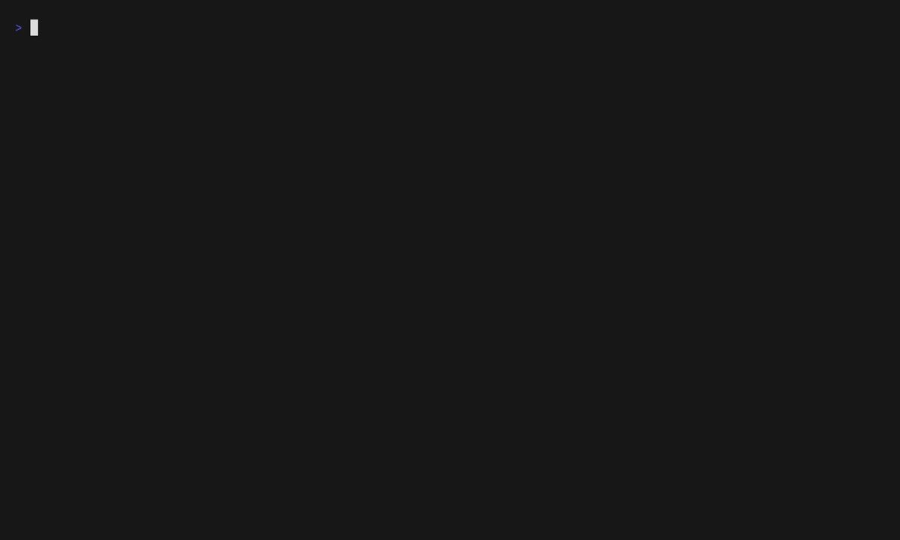

#### console2svg (`linux-bash`)

**launch-exit**

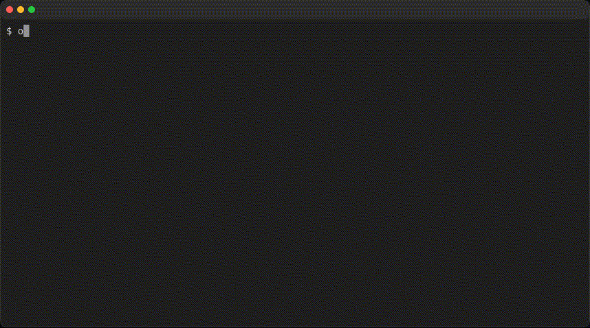

**help-tour**

**tui-splash**

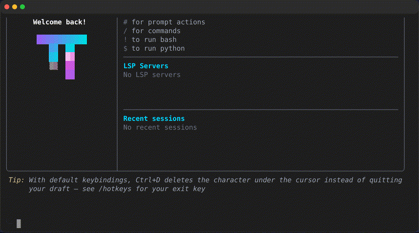

**typing-demo**

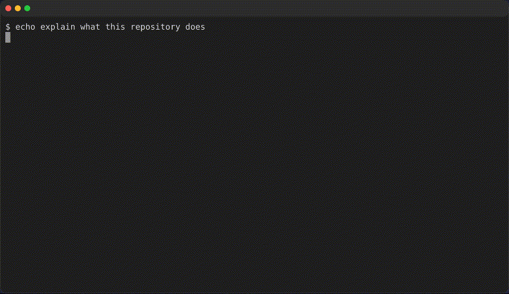

#### Foley (`linux-bash`)

**launch-exit**

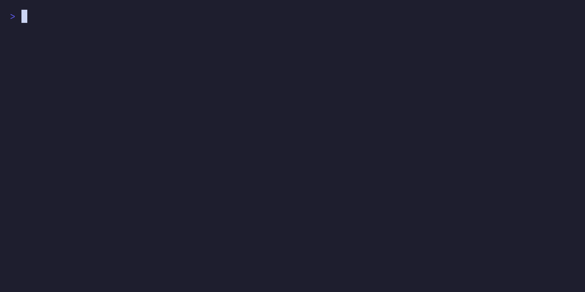

**help-tour**

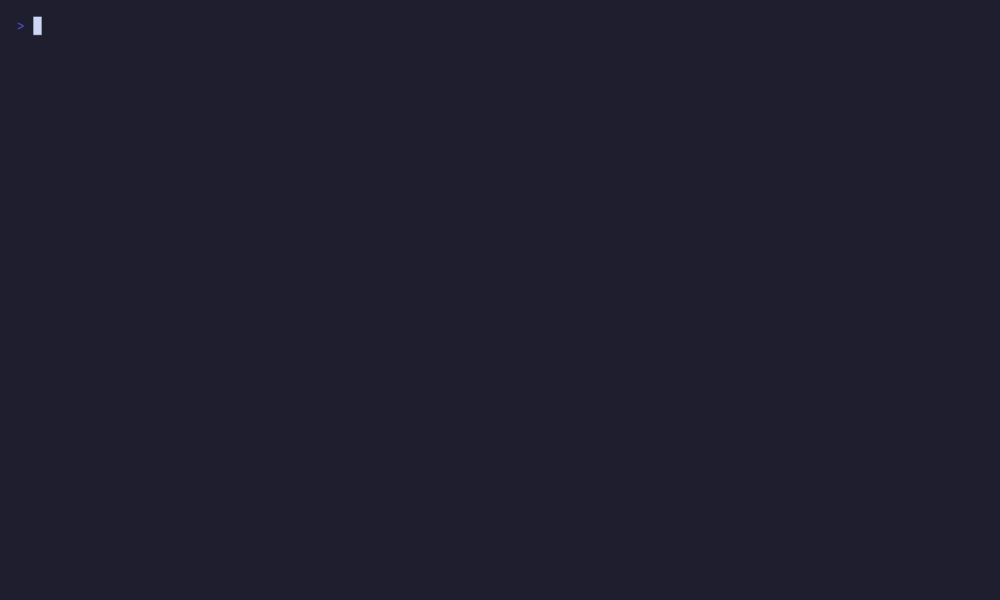

**tui-splash**

**typing-demo**

#### Betamax (joshka) (`linux-bash`)

**launch-exit**

**help-tour**

**tui-splash**

**typing-demo**

#### EVP (`linux-bash`)

**launch-exit**

**help-tour**

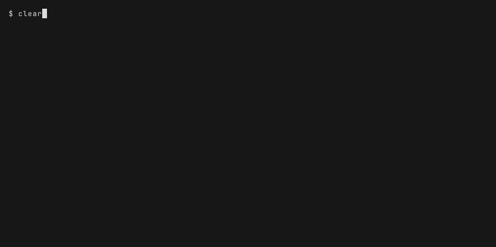

**tui-splash**

**typing-demo**

#### Demo Tape (`linux-bash`)

**launch-exit**

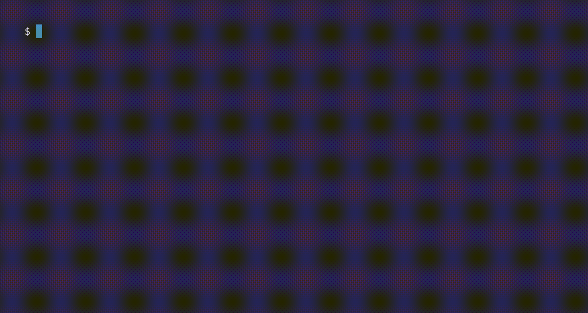

**help-tour**

**tui-splash**

**typing-demo**

#### asciinema + agg (`linux-bash`)

**launch-exit**

**help-tour**

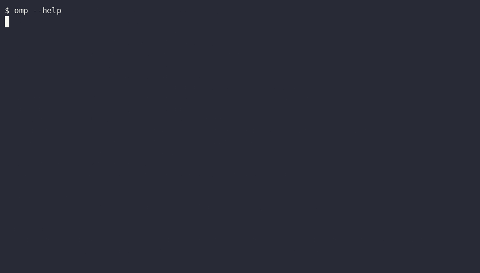

**tui-splash**

**typing-demo**

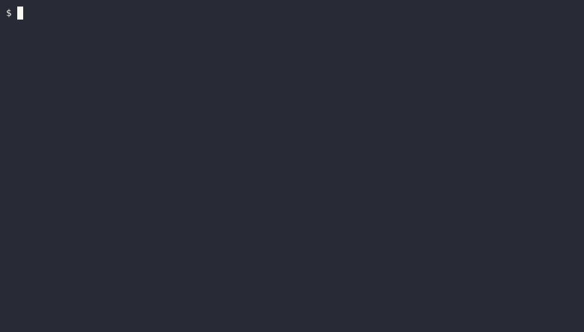

#### PowerSession-rs + agg (`windows-pwsh`)

**launch-exit**

**help-tour**

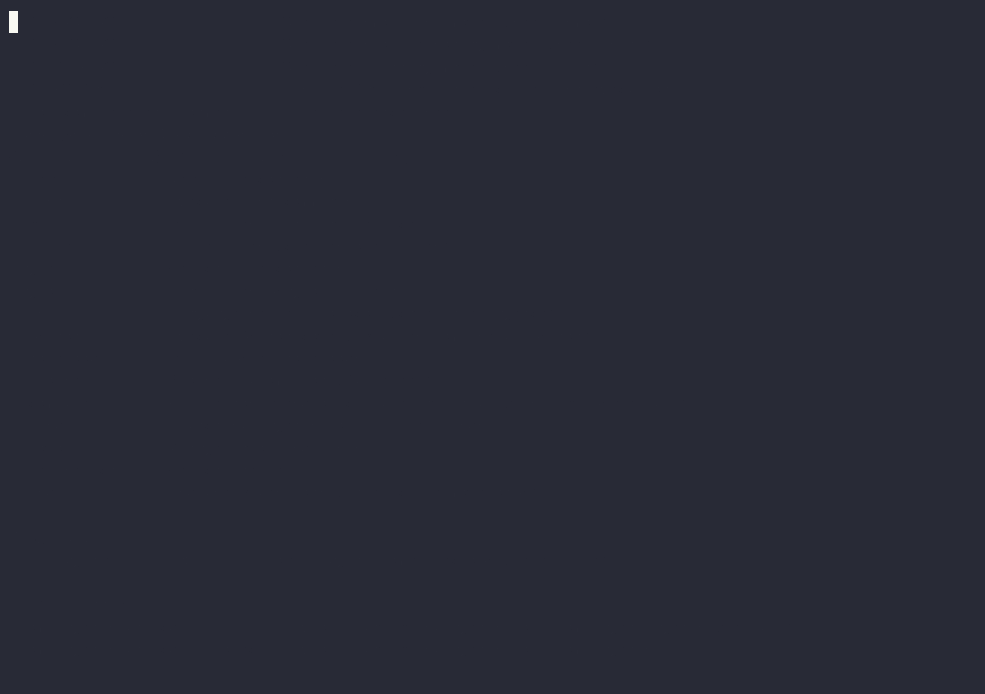

**tui-splash**

**typing-demo**

#### Terminalizer (`linux-bash`)

**launch-exit**

**help-tour**

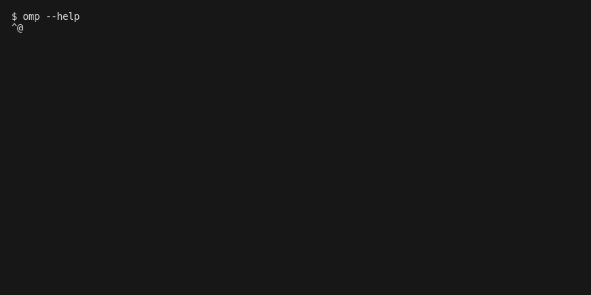

**tui-splash**

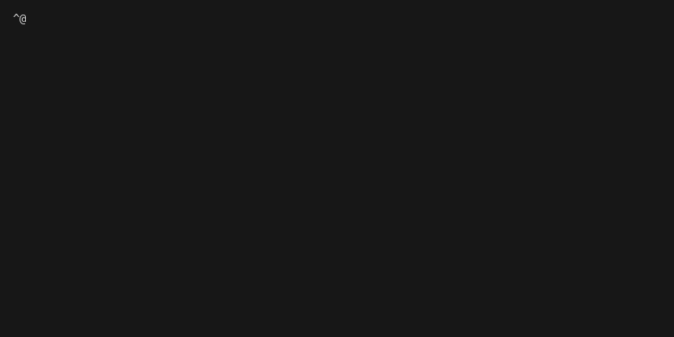

**typing-demo**

#### acast (`linux-bash`)

**launch-exit**

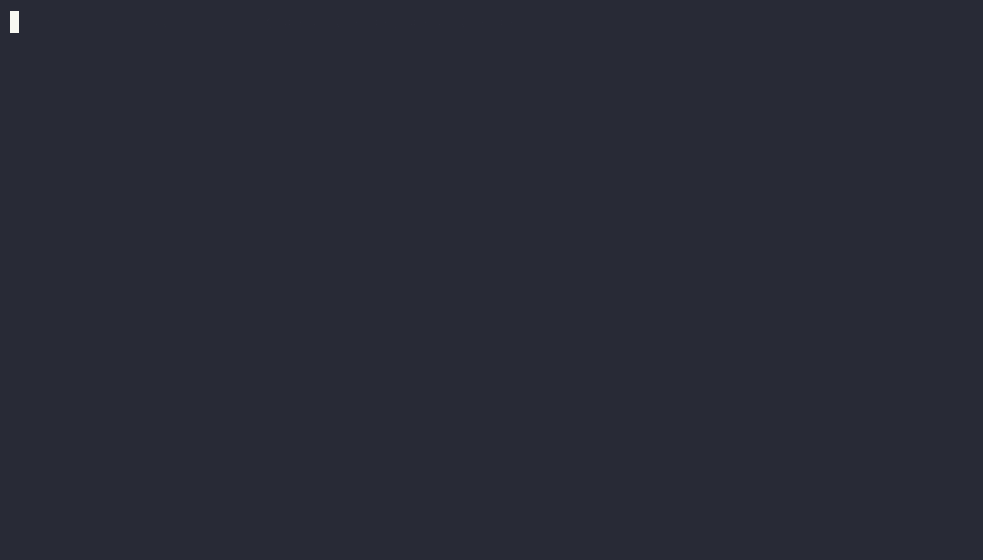

**help-tour**

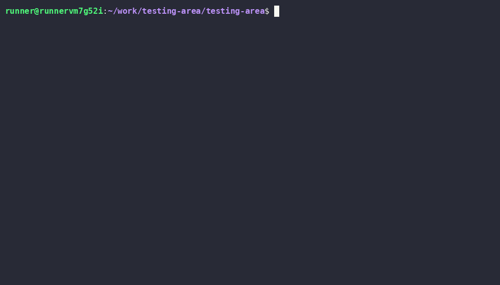

**tui-splash**

**typing-demo**

#### termsvg (`linux-bash`)

**launch-exit**

**help-tour**

**tui-splash**

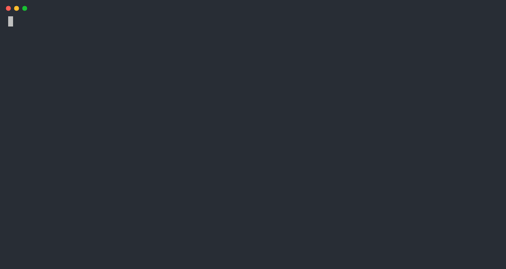

**typing-demo**

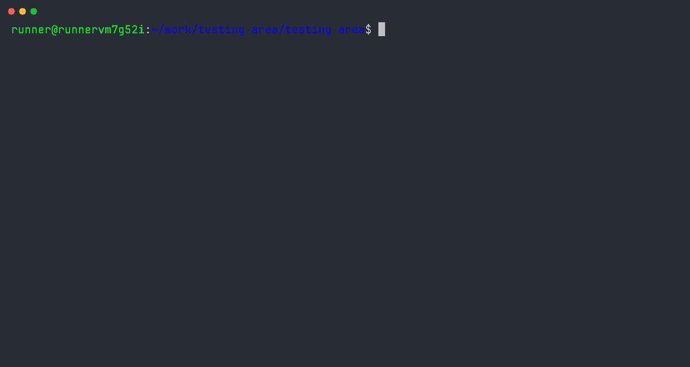

### Skipped Tools

| Tool | Reason skipped for CI-GIF evaluation |
|------|--------------------------------------|
| s-vhs | Not a maintained standalone product (means VHS itself or a DIY tmux+asciinema stack). |
| ttysvg | No matching maintained project; closest are termsvg / svg-term-cli / termtosvg. |
| TermRecord | Dead since 2017; outputs self-contained HTML, not GIF. |
| terminal-recorder | Stale since 2020; HTML output, no GIF path. |
| tty-record | Quiet; HTML (asciinema-player) output, no GIF path. |
| ovh-ttyrec | Maintained but no headless GIF path (ttygif needs X11). |
| script / scriptreplay | typescript only; no practical headless GIF converter. |
| t-rec | Screenshots a desktop window; fails on headless GHA (repo confirms). |
| ttygif | Converter needing ImageMagick + X11; fails headless. |
| termgif (pypi) | 1 star, unproven; no CI evidence. |
| asciinema-windows (Ruby) | Niche (1 star); PowerSession-rs is the stronger Windows path. |
| freeze | Static PNG/SVG, not animated GIF. |
| termshot | Static PNG; no Windows asset. |
| termtosvg | Read-only/archived since 2020; SVG only. |
| svg-term-cli | Unmaintained since 2019; SVG only. |
| asciicast2gif | Archived 2022 (PhantomJS); superseded by agg. |
| menyoki | Linux X11/Wayland window capture; needs a display. |
| Peek | GUI app, archived 2025; not headless. |

_Tools discovered beyond the original list and evaluated:_ console2svg, EVP, acast, termsvg.

[vhs]: https://github.com/charmbracelet/vhs
[console2svg]: https://github.com/arika0093/console2svg
[foley]: https://github.com/GH-Jaider/foley
[betamax]: https://github.com/joshka/betamax
[evp]: https://github.com/HalFrgrd/evp
[demotape]: https://github.com/fnando/demotape
[asciinema]: https://github.com/asciinema/asciinema
[powersession]: https://github.com/Watfaq/PowerSession-rs
[terminalizer]: https://github.com/faressoft/terminalizer
[acast]: https://github.com/gvcgo/asciinema
[termsvg]: https://github.com/mrmarble/termsvg
<!-- REPORT:END -->

## How to Reproduce

Everything runs in CI. In the Actions tab, run `rec-<tool>` on `testing-vhs`, or push a change
under that tool's workflow, its `scenarios/` directory, or `scripts/`. See the
[quickstart](specs/001-terminal-recorder-trials/quickstart.md).
