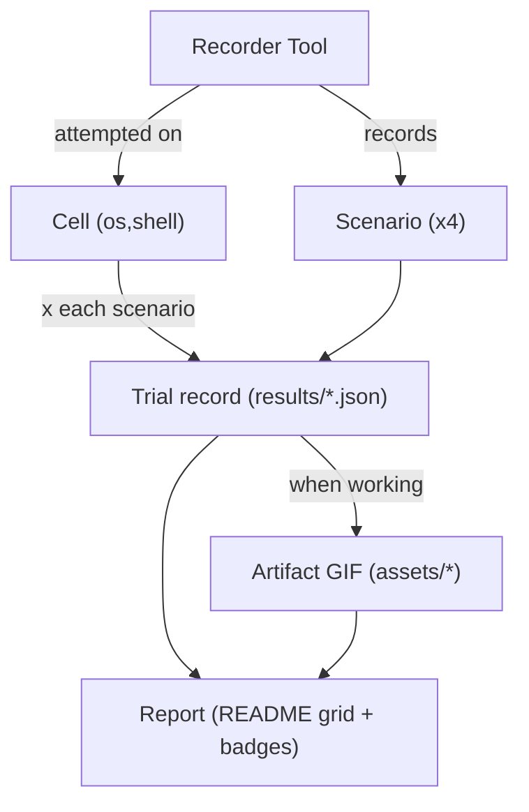

# Phase 1 Data Model: Terminal Recorder Trials

The "data" here is the evaluation record set that drives the report. Entities are files in the repo,
not database rows.

## Entity: Recorder Tool

A terminal-recording program under evaluation.

| Field | Type | Notes |
|-------|------|-------|
| id | string (slug) | e.g. `vhs`, `console2svg`; matches `rec-<id>.yml` and `assets/<id>/`. |
| name | string | Display name. |
| family | enum | `scripted` \| `interactive`. |
| pinned_version | string | Exact version installed in CI (determinism, FR-008). |
| native_formats | string[] | e.g. `["gif","mp4"]` or `["cast"]`. |
| converter | string \| null | GIF converter when native output is not GIF (e.g. `agg`, `ffmpeg`). |
| applicable_cells | Cell[] | The `{os, shell}` combinations attempted (Principle III). |

## Entity: Scenario

A deterministic recorded script. Exactly four, shared across all tools (see
`contracts/scenarios.md`).

| Field | Type | Notes |
|-------|------|-------|
| id | enum | `launch-exit` \| `help-tour` \| `tui-splash` \| `typing-demo`. |
| kind | enum | `minimal` (launch-exit) \| `creative` (others). |
| description | string | What it exercises (color, TUI, keystrokes, length). |

## Entity: Cell

One `{os, shell}` target.

| Field | Type | Notes |
|-------|------|-------|
| os | enum | `linux` \| `macos` \| `windows`. |
| shell | enum | `bash` \| `zsh` \| `pwsh`. |

## Entity: Trial (per-cell result record)

One CI evaluation of one tool, on one cell, for one scenario. Serialized to
`results/<tool>/<os>-<shell>-<scenario>.json` (schema: `contracts/result.schema.json`).

| Field | Type | Notes |
|-------|------|-------|
| tool | string | Tool id. |
| os | enum | Cell OS. |
| shell | enum | Cell shell. |
| scenario | enum | Scenario id. |
| verdict | enum | `working` \| `broken` \| `not-applicable`. |
| reason | string | Required when `broken`/`not-applicable`; empty allowed when `working`. |
| gif | string \| null | Repo-relative path under `assets/` when `working`. |
| extra | object | Optional: `mp4`/`svg` paths, omp version, tool version, run URL. |
| run_url | string | Link to the generating CI run (Principle V, SC-003). |

### Verdict rules (validation)

- `working` REQUIRES a non-empty, GIF-magic-valid file at `gif` (FR-006, FR-007). Enforced by
  `scripts/validate_gif.py`; a failed validation downgrades the cell to `broken`.
- `broken` and `not-applicable` REQUIRE a non-empty `reason` (FR-005, FR-013).
- No cell may be absent from `results/` — every applicable and non-applicable combination emits a
  record (SC-001, no blank grid cells).

## Entity: Artifact

A produced recording.

| Field | Type | Notes |
|-------|------|-------|
| path | string | `assets/<tool>/<os>-<shell>-<scenario>.gif` (GIF required). |
| optional_video | string \| null | `.mp4`/`.webm` sibling when the tool supports it (FR-012). |
| optional_svg | string \| null | `.svg` sibling when produced. |

## Entity: Report

The README-embedded synthesis, generated by `scripts/build_report.py`.

| Component | Source | Notes |
|-----------|--------|-------|
| status grid | `results/**/*.json` | tool × cell matrix; cells show verdict + link + reason. |
| badges | workflow files | `…/actions/workflows/rec-<tool>.yml/badge.svg` per tool. |
| embedded GIFs | `assets/**` | minimal + 3 creative per working tool (SC-004). |
| skipped ledger | research.md ledger | tools not evaluated, with reasons (Principle VI). |

## Relationships

